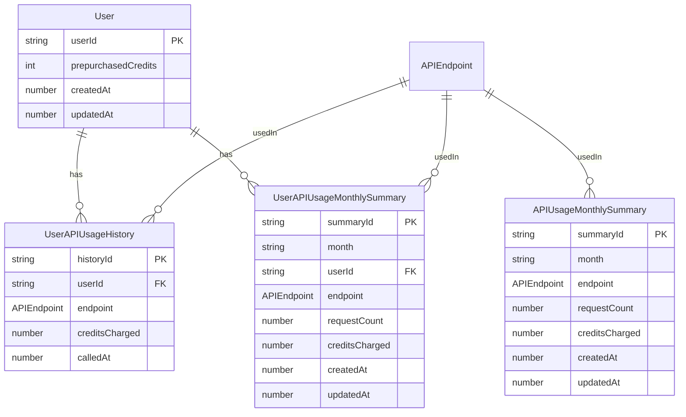

# 03 - Database Schema Design

## Overview

This schema is designed for a headless API service that manages user credits, tracks API usage, and enables monthly usage reporting.

## Features

- Deduct credits for API usage based on endpoint-specific cost
- Record every API call with detailed metadata (user, endpoint, timestamp, credits)
- Aggregate usage data per user and endpoint by month
- Maintain platform-wide statistics for API usage
- Support auditability, reporting, and efficient credit enforcement

## Why SQL

| Key Factor               | SQL (chosen)                                                                                                   | NoSQL (e.g., MongoDB)                                                                                                                              |
|--------------------------|----------------------------------------------------------------------------------------------------------------|-----------------------------------------------------------------------------------------------------------------------------------------------------|
| **Consistency**          | ✅ Supports ACID transactions — credit deduction and logging are atomic                                        | ⚠️ Manual consistency logic required (either implement deduct → log usage with manual rollback, or use replica-set transactions)                                 |
| **Querying & reporting** | ✅ Native `JOIN`, `GROUP BY`, aggregates — ideal for monthly summaries and future usage analytics               | ⚠️ Aggregation pipelines are powerful but verbose; cross-entity analysis requires more effort                                                      |
| **Auditability**         | ✅ Schema constraints + usage history tables provide reliable traceability                                     | ⚠️ Requires validation, transaction setup, and application-level safeguards to ensure complete logs (e.g., `$jsonSchema`, replica sets)           |
| **Scalability**          | ⚠️ Vertical scaling and sharding possible, but requires careful design and maintenance                        | ✅ Designed for horizontal scaling, ideal for high-volume, non-relational workloads                                                                 |

Based on the above — particularly the need for transactional consistency, structured reporting, usage traceability, and acceptable scalability — SQL was selected for this system.


## Schema Overview

| Table / Type                      | Purpose                                                                 |
|----------------------------------|-------------------------------------------------------------------------|
| `User`                           | Stores user identity and credit balance                                |
| `UserAPIUsageHistory`            | Records each API call and deducted credits                              |
| `UserAPIUsageMonthlySummary`     | Aggregates monthly usage per user and endpoint                          |
| `APIUsageMonthlySummary`         | Aggregates monthly usage platform-wide per endpoint                     |

## Configuration

- `APIEndpoint`: Enum of supported endpoints
- `apiQuotaMap`: Map of endpoint → credit cost
- All timestamps stored as UTC milliseconds
- `month` is formatted as `'YYYY-MM'` (e.g., `'2025-06'`)

## Entity Relationship Diagram



## Schema Details

### `User`

```ts
type User = {
  userId: string;               // User ID
  prepurchasedCredits: number;  // Available credits for API use
  createdAt: number;            // When the user was created (UTC)
  updatedAt: number;            // When the user info was last updated (UTC)
};
```

### `UserAPIUsageHistory`

```ts
type UserAPIUsageHistory = {
  historyId: string;         // Record ID
  userId: string;            // Who made the API call
  endpoint: APIEndpoint;     // Which API was called
  creditsCharged: number;    // Credits deducted for the call
  calledAt: number;          // When the call was made (UTC)
};
```

### `UserAPIUsageMonthlySummary`

```ts
type UserAPIUsageMonthlySummary = {
  summaryId: string;         // Summary ID
  month: string;             // Month (format: 'YYYY-MM')
  userId: string;            // Who used the API
  endpoint: APIEndpoint;     // Which API was used
  requestCount: number;      // Number of times this user used the API this month
  creditsCharged: number;    // Total credits deducted for this user this month
  createdAt: number;         // When this summary was created (UTC)
  updatedAt: number;         // When it was last updated (UTC)
};
```

### `APIUsageMonthlySummary`

```ts
type APIUsageMonthlySummary = {
  summaryId: string;         // Summary ID
  month: string;             // Month (format: 'YYYY-MM')
  endpoint: APIEndpoint;     // The API endpoint
  requestCount: number;      // Total number of calls from all users this month
  creditsCharged: number;    // Total credits deducted from all users this month
  createdAt: number;         // When this summary was created (UTC)
  updatedAt: number;         // When it was last updated (UTC)
};
```